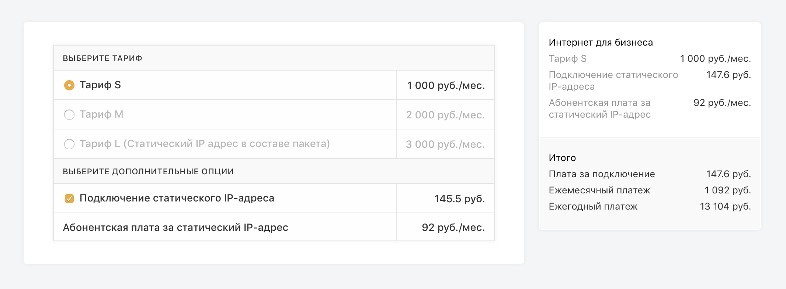

## Задачка

Необходимо сделать небольшой калькулятор цен на интернет. Визуальная часть уже готова, осталось только добавить Redux.

Шустрые маркетологи интернет провайдера обязательно захотят добавить новых опций и правил 🚀. Не пишите лишний код, но будьте готовы обсудить план встраивания неожиданных фич.

Результаты вместе с резюме присылайте в виде ссылки на публичный репозиторй (github/bitbucket/etc.) или архивом на почту op@staply.co



### Правила работы опций

- Можно выбрать один из трех тарифов S/M/L.
- Можно выбрать статический IP адрес. Если выбрано подключение, то абонентская плата выбирается автоматически. Абонентскую плату отдельно выбирать нельзя.
- Если выбран тариф L, то дополнительные опции скрываются из калькулятора.

### Чек

Чек отображает выбранные опции и считает итоги.

- Плата за подключение - общая сумма опций подключения.
- Ежемесячный платеж - общая сумма ежемесячных опций.
- Ежегодный платеж - ежемесячный платеж, умноженный на 12.

### Бонусное задание

- Предложить вариант мобильной верстки данного калькулятора

### Запуск на localhost:3000

```
npm run start
```

Удачи 💪🧠
